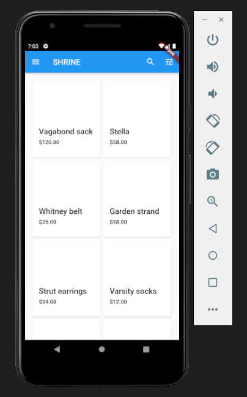

# Flutter - Google Codelabs

## MDC-101 Flutter: Material Components / Ekran Görüntüsü

## MDC-102 Flutter: Material Structure and Layout / Ekran Görüntüsü

## MDC-103 Flutter: Material Theming with Color, Shape, Elevation, and Type / Ekran Görüntüsü

 
